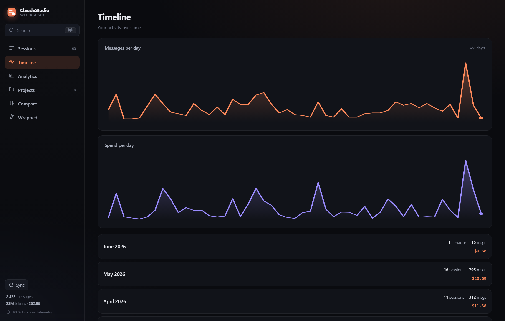

<div align="center">


<h1>ClaudeStudio</h1>

**The desktop app Claude Code deserves.**
Explore, search, replay, and understand every Claude Code session — all on your machine.

[](https://github.com/ingridtoulotte/claudestudio/actions/workflows/ci.yml)


[](https://github.com/ingridtoulotte/claudestudio/releases)
[](https://github.com/ingridtoulotte/claudestudio/stargazers)

[Highlights](#-highlights) · [Quickstart](#-quickstart) · [Features](#-features) · [Why ClaudeStudio](#-why-claudestudio) · [How it works](#-how-it-works) · [CLI](#-cli) · [Privacy](#-privacy--trust) · [FAQ](#-faq)

<br/>



<sub><i>Replay any session like a movie — prompt → thinking → tool calls → result, on a scrubable timeline.</i></sub>

</div>

---

## ✨ Highlights

- 🔒 **100% local, zero dependencies** — pure Python standard library. No `pip install`, no `node_modules`, no telemetry, no phone-home.
- 🗂 **Browse every session** — fast, sortable, filterable list of every Claude Code conversation; star the keepers, archive the noise.
- 🔎 **Search everything, instantly** — SQLite **FTS5 / BM25** full-text across every prompt, response, thinking block, and tool call, behind a <kbd>⌘K</kbd> / <kbd>Ctrl K</kbd> palette.
- ⏯ **Replay sessions like a movie** — watch a conversation unfold on a scrubable timeline: prompt → thinking → tool calls → result.
- ✦ **Ask your history** — grounded, deterministic local Q&A with deep-link citations. **Zero model calls, nothing uploaded, no API key.**
- 📊 **Cost & usage analytics** — deterministic spend at public Anthropic prices (cache-aware), plus tokens, tools, and a weekday×hour heatmap.
- 📤 **Export & share** — turn any session into clean Markdown or a single self-contained HTML page.

---

## The problem

You use Claude Code every day. Over a few months you accumulate **hundreds of sessions, millions of tokens, thousands of tool calls** — a real body of work and knowledge.

Then it evaporates. Sessions vanish into `~/.claude/projects/*.jsonl`. That brilliant debugging path from three weeks ago? Gone. The refactor where everything clicked? Unfindable. How much have you actually spent? No idea.

**You have the data. You don't have a workspace.**

ClaudeStudio is that workspace — a fast, local, beautiful home for everything you and Claude have ever built together.

<div align="center">

</div>

---

## ⚡ Quickstart

ClaudeStudio is **pure Python standard library** — no `pip install`, no `node_modules`, no build step. If you have Python 3.9+, you can run it.

**Try it in one command — no clone, no install** (needs [`pipx`](https://pipx.pypa.io)):

```bash
pipx run --spec git+https://github.com/ingridtoulotte/claudestudio claudestudio
```

That builds it in a throwaway environment and launches the app. Prefer a checkout?

```bash
git clone https://github.com/ingridtoulotte/claudestudio
cd claudestudio

# Launch the app — it indexes your sessions and opens in a window
python -m claudestudio
```

Either way: ClaudeStudio finds `~/.claude/projects`, builds a local index, and opens the workspace in an app window (Chrome/Edge app-mode if available, otherwise your browser).

**Just want to look around first?** Explore a realistic, fully synthetic dataset — no real data touched:

```bash
python -m claudestudio demo --serve
```

<div align="center">

</div>

---

## ✦ Features

### 🗂 Browse every session
A fast, sortable, filterable list of every conversation. Search titles, filter by favorites, sort by recency, cost, message count, tools used, or duration. Star the keepers, archive the noise.

### ✦ Ask your history — a grounded, local companion
A question box for your whole Claude Code history. Ask *"what should I reopen next?"*, *"give me a handoff brief"*, *"which files changed?"*, *"why was `parser.py` edited?"*, or *"where did the tokens go?"* and get a structured answer with **citations that deep-link straight to the exact session and message**.

It is **grounded, not generative**: every answer is *computed* from your local index with deterministic rules — **no model calls, nothing uploaded, no API key.** The same question always gives the same answer, and each one is footed with what it was computed from. Open any session and hit **✦ Ask about this** to scope it to that session (digest, handoff brief, most-important tool calls).

### ⏯ Replay sessions like a movie
Watch Claude work. Press play and the conversation unfolds chronologically — prompts, thinking, tool calls, and edits revealing themselves with real pacing. Scrub the timeline, jump anywhere, change speed.

<div align="center">

</div>

### 🔎 Search everything, instantly
Full-text search (SQLite **FTS5**, BM25-ranked) across every prompt, response, thinking block, and tool call you've ever made. Open the command palette with <kbd>⌘K</kbd> / <kbd>Ctrl K</kbd> and find anything in milliseconds.

<div align="center">

</div>

### 📊 Understand your usage & cost
Tokens, models, tools, daily activity, a weekday-×-hour heatmap, and a **deterministic cost estimate** at public Anthropic prices (cache writes & reads priced correctly; unpriced models are flagged, never guessed).

### 🗃 Project workspace
Every repo Claude has touched, grouped and ranked — sessions, messages, spend, and last-active at a glance. Click through to that project's sessions.

<div align="center">

</div>

### 📈 Timeline
Your whole history as activity over time — messages per day, spend per day, and a month-by-month breakdown.

<div align="center">

</div>

### ⚖️ Compare sessions
Put any two sessions side by side — messages, prompts, tool calls, tokens, cost, duration — with the winner highlighted per row.

<div align="center">

</div>

### 📤 Export & share a session
Turn any session into a clean **Markdown** file or a **single self-contained HTML** page (inline styles, no scripts, no network) — perfect for an issue, a PR, or a gist. From the session view hit `⬇ .md` / `⬇ .html`, or use the CLI: `python -m claudestudio export <session-id> --format html`.

### 🔖 Saved searches & smart collections
Save any filter — a query, a sort, favorites-only, a project — as a named collection and jump back to it in one click. Saved collections live in your local index and survive every re-index.

### 🎁 Claude Wrapped
A shareable, swipeable, year-or-all-time summary of your Claude Code life. Your go-to model, favourite tool, home-base project, peak hours, epic session — copy it, or **save it as a PNG card** to share.

<div align="center">

</div>

---

## 🆚 Why ClaudeStudio

|                              | Raw `.jsonl` logs | `cat` / `grep` in terminal | Generic log viewer | **ClaudeStudio** |
|------------------------------|:-----------------:|:--------------------------:|:------------------:|:----------------:|
| Browse & sort sessions       | ❌                | ⚠️ manual                  | ⚠️                 | ✅               |
| Full-text search w/ ranking  | ❌                | ⚠️ line-by-line            | ⚠️                 | ✅ FTS5 + BM25   |
| Chronological replay         | ❌                | ❌                         | ❌                 | ✅               |
| Rich tool-call inspection    | ❌                | ❌                         | ❌                 | ✅               |
| Token & **cost** analytics   | ❌                | ❌                         | ❌                 | ✅ deterministic |
| Project & timeline views     | ❌                | ❌                         | ❌                 | ✅               |
| Favorites / archive / tags   | ❌                | ❌                         | ⚠️                 | ✅               |
| Premium, screenshot-worthy UI| ❌                | ❌                         | ❌                 | ✅               |
| 100% local, no telemetry     | ✅                | ✅                         | ⚠️                 | ✅               |
| Zero dependencies            | —                 | ✅                         | ❌                 | ✅ stdlib only   |

---

## 🛠 How it works

```
~/.claude/projects/**/*.jsonl                          your sessions, untouched
        │
        ▼
   parser.py            faithful, normalized model of the wire format
        │
        ▼
   index.py  ──────►   SQLite + FTS5            ~/.claudestudio/index.db
        │              · denormalized sessions table (instant sort/filter)
        │              · BM25 full-text index over messages + tool calls
        │              · incremental: unchanged files are skipped by (mtime,size)
        │              · your favorites / archive / tags survive every re-index
        ▼
   server.py  ◄──────  http.server on 127.0.0.1 (local only, no outbound calls)
        │              JSON API  +  static SPA
        ▼
   web/  (vanilla JS + CSS, no build step)     premium dark UI, hand-rolled charts
```

**Performance is a feature.** The index is denormalized for the common queries and backed by FTS5, so search and listing stay instant across thousands of sessions and millions of messages. Re-indexing is incremental — only changed files are re-parsed.

### Why this stack? (Electron / Tauri / React were all considered)

| Choice | Decision | Why |
|---|---|---|
| **Runtime** | Python **stdlib only** | The single strongest feature is *zero friction*: if you can run Claude Code, you can run this. No toolchain, no `npm`, no Rust, no 200 MB Electron download. |
| **Storage** | **SQLite + FTS5** | Ships with Python. Handles millions of rows and gives real full-text ranking for free. Survives years of history without degradation. |
| **Desktop shell** | Local web app, opened in a Chrome/Edge **app window** | All the polish of a modern UI with none of the bundle weight. One codebase, every OS. A thin Tauri wrapper is on the roadmap for those who want a true native window/installer. |
| **Frontend** | **Vanilla JS + CSS**, no framework | No build step means the repo runs as-is, forever. The UI is hand-built so every screen feels intentional rather than templated. |

Everything is **deterministic and transparent** — the cost table lives in one editable file ([`pricing.py`](claudestudio/pricing.py)), and `--selftest` asserts the numbers exactly.

---

## 🧩 For builders — use the parser, don't reverse-engineer the format

Building your own Claude Code tooling? ClaudeStudio's parser is a clean,
dependency-free reference implementation of the session wire format. Import it
instead of reading raw `.jsonl` by hand:

```python
from claudestudio import parse_session, iter_session_files, default_projects_root

for path in iter_session_files(default_projects_root()):
    s = parse_session(path)          # -> ParsedSession | None
    if s:
        print(s.title, s.user_msgs, "prompts", round(s.cost_usd, 4), "USD")
```

The full wire-format reference — record types, content blocks, usage/cost, and
every dataclass field — is documented in **[docs/FORMAT.md](docs/FORMAT.md)**.
The public API (`parse_session`, `iter_session_files`, `default_projects_root`,
`ParsedSession` / `Message` / `ToolCall`) is covered by the self-test.

---

## 💻 CLI

```text
python -m claudestudio [command]

  (no command)   build the index if needed, then launch the app
  serve          launch the desktop app          --port --host --no-browser
  index          scan & (incrementally) index     --force
  list           list sessions (filter & sort)    -q --project --model --since/--until --sort
  search         full-text search (BM25)          --kind --project --since/--until --json
  ask            grounded Q&A over your history   --session --json
  export         export a session to Markdown/HTML --format md|html --out FILE
  wrapped        print your Claude Wrapped         --year YYYY
  stats          headline numbers
  doctor         diagnose environment & index health
  demo           generate synthetic data & explore --count N --serve
  --selftest     run the built-in correctness suite (154 checks, no deps)

  shared flags:  --db <path>   --root <projects dir>
```

```bash
python -m claudestudio ask "what should I reopen next?"   # grounded, no model calls
python -m claudestudio doctor      # is everything wired up?
python -m claudestudio wrapped     # your year in review, in the terminal
python -m claudestudio stats       # quick totals
```

---

## 🔒 Privacy & trust

ClaudeStudio is built for people who care where their data goes.

- **100% local.** Your sessions never leave your machine. The server binds to `127.0.0.1` only.
- **No telemetry. No analytics. No phone-home.** Grep the source — there isn't a single outbound network call.
- **No cloud, no account, no lock-in.** The index is a plain SQLite file at `~/.claudestudio/index.db`; delete it anytime and re-build in seconds.
- **Open source & deterministic.** Pricing and aggregations are transparent and covered by an exact-assertion self-test.
- **Responsible disclosure.** Found something? See the [security policy](SECURITY.md) — the attack surface is deliberately tiny, and the localhost server is hardened (0.4.0+).

---

## 🗺 Roadmap

- [x] Run in one command with `pipx run` (no clone) — _v0.2_
- [x] Export a session to Markdown / shareable HTML — _v0.2_
- [x] Saved searches & smart collections — _v0.2_
- [x] Wrapped → shareable PNG card — _v0.2_
- [x] Documented public parser API (`from claudestudio import parse_session`) + [FORMAT.md](docs/FORMAT.md) — _v0.2_
- [x] **Ask** — grounded, local Q&A over your history (handoff briefs, "what to reopen", file history) — _v0.3_
- [ ] Native window + installers via an optional Tauri shell
- [ ] Knowledge graph (projects ↔ sessions ↔ files ↔ concepts)
- [ ] Smart highlights — auto-surface breakthroughs, fixes, and recurring patterns
- [ ] Diff view inside replay (file-level evolution across a session)

Ideas and PRs welcome — see [CONTRIBUTING](CONTRIBUTING.md). Everything shipped so far lives in the [changelog](CHANGELOG.md).

---

## ❓ FAQ

<details>
<summary><b>Does any of my data leave my machine?</b></summary>

No. ClaudeStudio reads `~/.claude/projects` locally, builds a SQLite index on disk, and serves the UI from `127.0.0.1`. There are zero outbound network calls — `grep -r http claudestudio/` and see for yourself.
</details>

<details>
<summary><b>Do I need to install anything (pip, npm, Rust, Electron)?</b></summary>

No. It's pure Python standard library. If you can run Claude Code, you already have everything: `git clone`, then `python -m claudestudio`. No `pip install`, no `node_modules`, no build step.
</details>

<details>
<summary><b>Will it touch or modify my session files?</b></summary>

Never. ClaudeStudio only **reads** your `.jsonl` files. Everything it generates (the index, your favorites/archive/tags) lives in a separate file at `~/.claudestudio/index.db`. Delete it anytime and rebuild in seconds.
</details>

<details>
<summary><b>How accurate is the cost estimate?</b></summary>

It's deterministic, not a guess. Token counts come straight from your session logs and are multiplied by public Anthropic prices (with cache writes and cache reads priced separately). The price table lives in one editable file — [`pricing.py`](claudestudio/pricing.py) — and `--selftest` asserts the math exactly. Models with no published price are **flagged**, never silently estimated.
</details>

<details>
<summary><b>How fast is it on a large history?</b></summary>

Built for it. The index is denormalized for the common queries and backed by SQLite FTS5/BM25, so listing and search stay instant across thousands of sessions and millions of messages. Re-indexing is incremental — unchanged files are skipped by `(mtime, size)`.
</details>

<details>
<summary><b>I just want to see it without exposing my own data.</b></summary>

Run `python -m claudestudio demo --serve`. It generates a realistic, fully synthetic corpus and opens the full app against it — your real sessions are never read.
</details>

<details>
<summary><b>Search says "degraded" — what's wrong?</b></summary>

Your Python was built without SQLite FTS5 (rare, but happens on some minimal builds). Run `python -m claudestudio doctor` to confirm. Everything else works; only full-text ranking is affected.
</details>

---

## 🤝 Contributing

```bash
python -m claudestudio --selftest   # must print ALLPASS before you push
python -m claudestudio demo --serve # iterate on the UI against synthetic data
```

No dependencies to install, no build step to learn. See [CONTRIBUTING.md](CONTRIBUTING.md).

## 📄 License

[MIT](LICENSE) © ClaudeStudio contributors

---

<div align="center">

### Your Claude Code history deserves a home.

If ClaudeStudio gave your sessions a place to live, **drop a ⭐** — it's the single biggest thing that helps other developers find it.

[](https://github.com/ingridtoulotte/claudestudio/stargazers)

<sub>Built for the Claude Code community · 100% local · zero dependencies</sub>

</div>
