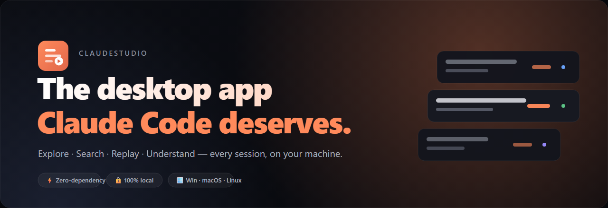
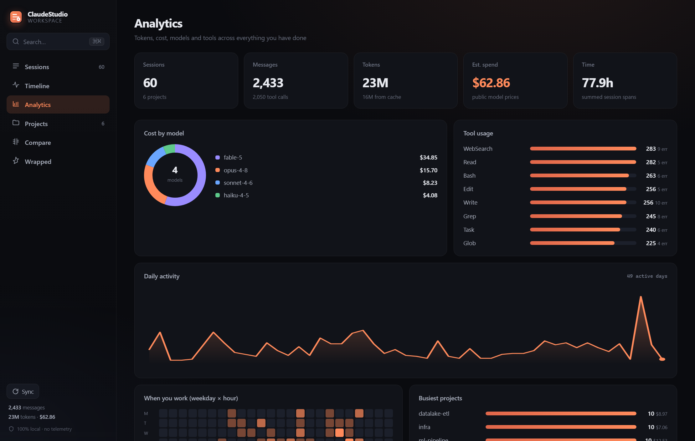
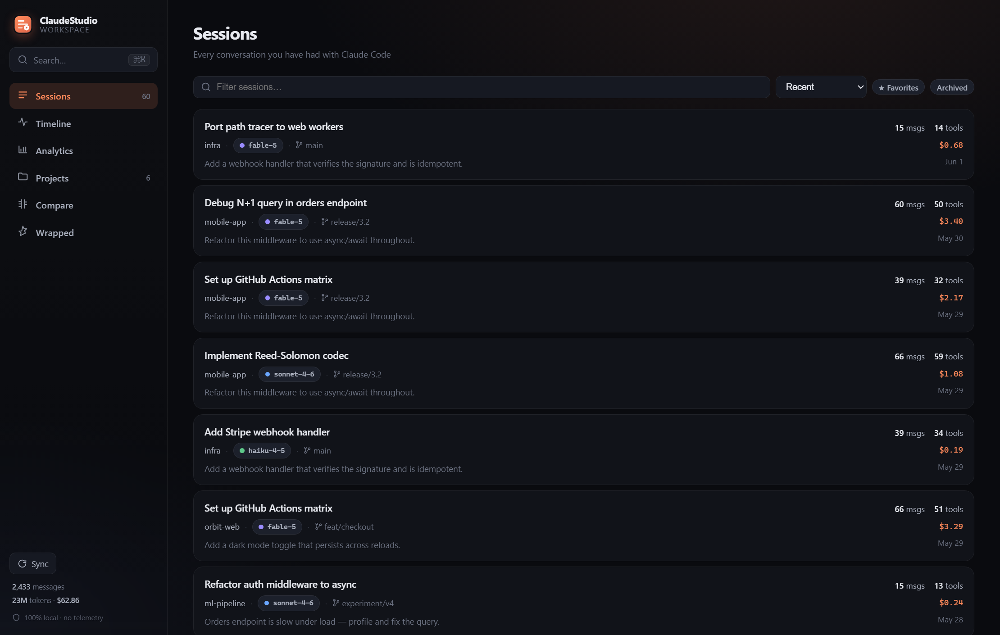
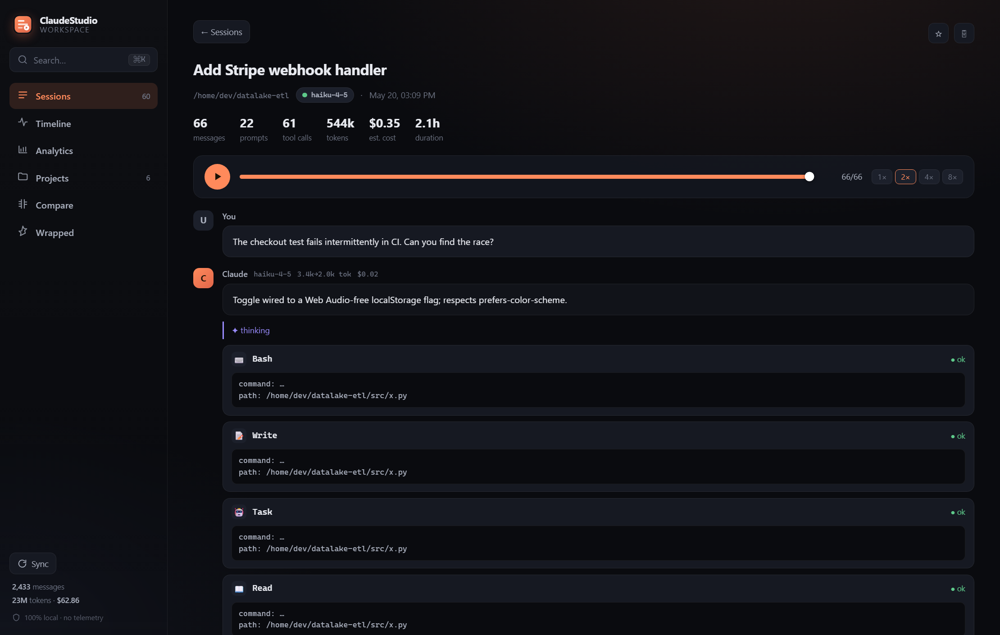
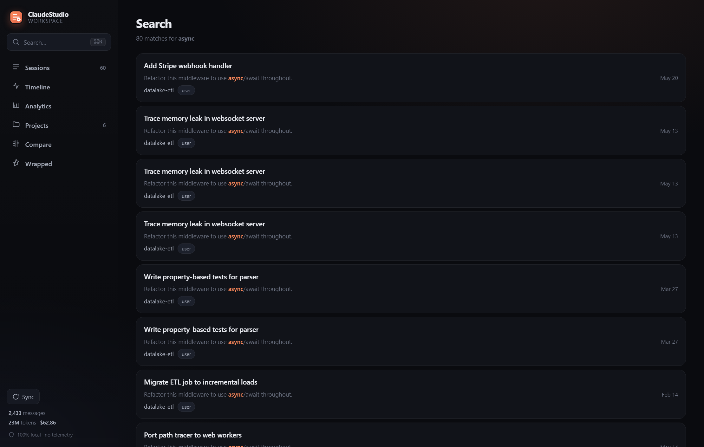
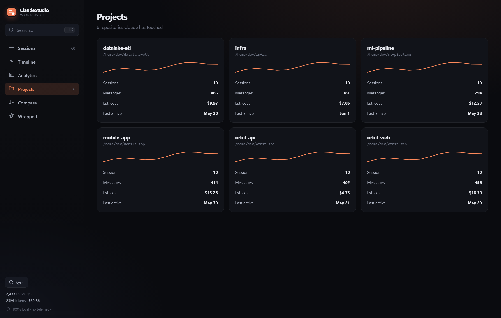
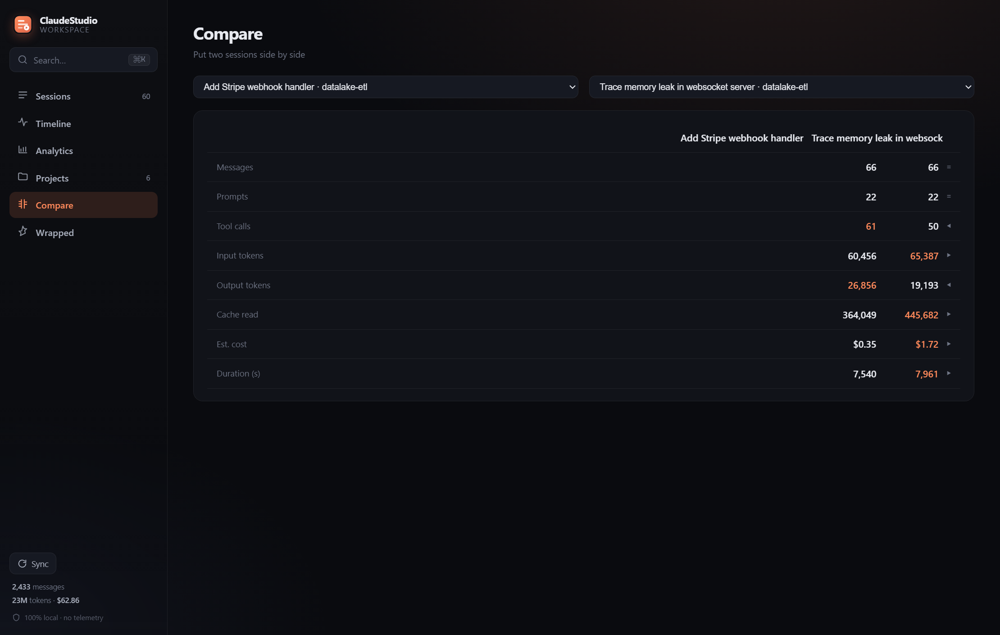
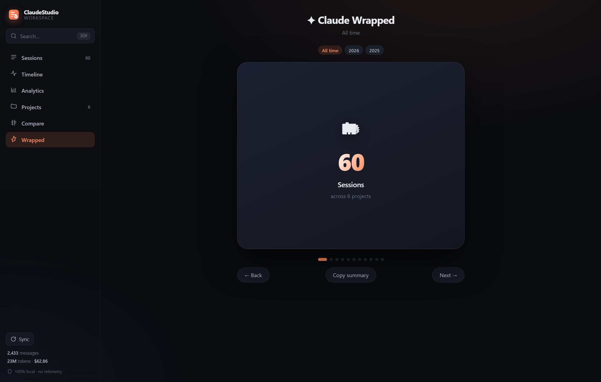

<div align="center">



<h1>ClaudeStudio</h1>

**The desktop app Claude Code deserves.**
Explore, search, replay, and understand every Claude Code session — all on your machine.

[](https://github.com/ingridtoulotte/claudestudio/actions/workflows/ci.yml)


[Quickstart](#-quickstart) · [Features](#-features) · [Why ClaudeStudio](#-why-claudestudio) · [How it works](#-how-it-works) · [CLI](#-cli) · [Privacy](#-privacy--trust)

</div>

---

## The problem

You use Claude Code every day. Over a few months you accumulate **hundreds of sessions, millions of tokens, thousands of tool calls** — a real body of work and knowledge.

Then it evaporates. Sessions vanish into `~/.claude/projects/*.jsonl`. That brilliant debugging path from three weeks ago? Gone. The refactor where everything clicked? Unfindable. How much have you actually spent? No idea.

**You have the data. You don't have a workspace.**

ClaudeStudio is that workspace — a fast, local, beautiful home for everything you and Claude have ever built together.

<div align="center">

</div>

---

## ⚡ Quickstart

ClaudeStudio is **pure Python standard library** — no `pip install`, no `node_modules`, no build step. If you have Python 3.9+, you can run it.

```bash
git clone https://github.com/ingridtoulotte/claudestudio
cd claudestudio

# Launch the app — it indexes your sessions and opens in a window
python -m claudestudio
```

That's it. ClaudeStudio finds `~/.claude/projects`, builds a local index, and opens the workspace in an app window (Chrome/Edge app-mode if available, otherwise your browser).

**Just want to look around first?** Explore a realistic, fully synthetic dataset — no real data touched:

```bash
python -m claudestudio demo --serve
```

<div align="center">

</div>

---

## ✦ Features

### 🗂 Browse every session
A fast, sortable, filterable list of every conversation. Search titles, filter by favorites, sort by recency, cost, message count, tools used, or duration. Star the keepers, archive the noise.

### ⏯ Replay sessions like a movie
Watch Claude work. Press play and the conversation unfolds chronologically — prompts, thinking, tool calls, and edits revealing themselves with real pacing. Scrub the timeline, jump anywhere, change speed.

<div align="center">

</div>

### 🔎 Search everything, instantly
Full-text search (SQLite **FTS5**, BM25-ranked) across every prompt, response, thinking block, and tool call you've ever made. Open the command palette with <kbd>⌘K</kbd> / <kbd>Ctrl K</kbd> and find anything in milliseconds.

<div align="center">

</div>

### 📊 Understand your usage & cost
Tokens, models, tools, daily activity, a weekday-×-hour heatmap, and a **deterministic cost estimate** at public Anthropic prices (cache writes & reads priced correctly; unpriced models are flagged, never guessed).

### 🗃 Project workspace
Every repo Claude has touched, grouped and ranked — sessions, messages, spend, and last-active at a glance. Click through to that project's sessions.

<div align="center">

</div>

### 📈 Timeline
Your whole history as activity over time — messages per day, spend per day, and a month-by-month breakdown.

### ⚖️ Compare sessions
Put any two sessions side by side — messages, prompts, tool calls, tokens, cost, duration — with the winner highlighted per row.

<div align="center">

</div>

### 🎁 Claude Wrapped
A shareable, swipeable, year-or-all-time summary of your Claude Code life. Your go-to model, favourite tool, home-base project, peak hours, epic session — copy it and share.

<div align="center">

</div>

---

## 🆚 Why ClaudeStudio

|                              | Raw `.jsonl` logs | `cat` / `grep` in terminal | Generic log viewer | **ClaudeStudio** |
|------------------------------|:-----------------:|:--------------------------:|:------------------:|:----------------:|
| Browse & sort sessions       | ❌                | ⚠️ manual                  | ⚠️                 | ✅               |
| Full-text search w/ ranking  | ❌                | ⚠️ line-by-line            | ⚠️                 | ✅ FTS5 + BM25   |
| Chronological replay         | ❌                | ❌                         | ❌                 | ✅               |
| Rich tool-call inspection    | ❌                | ❌                         | ❌                 | ✅               |
| Token & **cost** analytics   | ❌                | ❌                         | ❌                 | ✅ deterministic |
| Project & timeline views     | ❌                | ❌                         | ❌                 | ✅               |
| Favorites / archive / tags   | ❌                | ❌                         | ⚠️                 | ✅               |
| Premium, screenshot-worthy UI| ❌                | ❌                         | ❌                 | ✅               |
| 100% local, no telemetry     | ✅                | ✅                         | ⚠️                 | ✅               |
| Zero dependencies            | —                 | ✅                         | ❌                 | ✅ stdlib only   |

---

## 🛠 How it works

```
~/.claude/projects/**/*.jsonl                          your sessions, untouched
        │
        ▼
   parser.py            faithful, normalized model of the wire format
        │
        ▼
   index.py  ──────►   SQLite + FTS5            ~/.claudestudio/index.db
        │              · denormalized sessions table (instant sort/filter)
        │              · BM25 full-text index over messages + tool calls
        │              · incremental: unchanged files are skipped by (mtime,size)
        │              · your favorites / archive / tags survive every re-index
        ▼
   server.py  ◄──────  http.server on 127.0.0.1 (local only, no outbound calls)
        │              JSON API  +  static SPA
        ▼
   web/  (vanilla JS + CSS, no build step)     premium dark UI, hand-rolled charts
```

**Performance is a feature.** The index is denormalized for the common queries and backed by FTS5, so search and listing stay instant across thousands of sessions and millions of messages. Re-indexing is incremental — only changed files are re-parsed.

### Why this stack? (Electron / Tauri / React were all considered)

| Choice | Decision | Why |
|---|---|---|
| **Runtime** | Python **stdlib only** | The single strongest feature is *zero friction*: if you can run Claude Code, you can run this. No toolchain, no `npm`, no Rust, no 200 MB Electron download. |
| **Storage** | **SQLite + FTS5** | Ships with Python. Handles millions of rows and gives real full-text ranking for free. Survives years of history without degradation. |
| **Desktop shell** | Local web app, opened in a Chrome/Edge **app window** | All the polish of a modern UI with none of the bundle weight. One codebase, every OS. A thin Tauri wrapper is on the roadmap for those who want a true native window/installer. |
| **Frontend** | **Vanilla JS + CSS**, no framework | No build step means the repo runs as-is, forever. The UI is hand-built so every screen feels intentional rather than templated. |

Everything is **deterministic and transparent** — the cost table lives in one editable file ([`pricing.py`](claudestudio/pricing.py)), and `--selftest` asserts the numbers exactly.

---

## 💻 CLI

```text
python -m claudestudio [command]

  (no command)   build the index if needed, then launch the app
  serve          launch the desktop app          --port --host --no-browser
  index          scan & (incrementally) index     --force
  wrapped        print your Claude Wrapped         --year YYYY
  stats          headline numbers
  doctor         diagnose environment & index health
  demo           generate synthetic data & explore --count N --serve
  --selftest     run the built-in correctness suite (48 checks, no deps)

  shared flags:  --db <path>   --root <projects dir>
```

```bash
python -m claudestudio doctor      # is everything wired up?
python -m claudestudio wrapped     # your year in review, in the terminal
python -m claudestudio stats       # quick totals
```

---

## 🔒 Privacy & trust

ClaudeStudio is built for people who care where their data goes.

- **100% local.** Your sessions never leave your machine. The server binds to `127.0.0.1` only.
- **No telemetry. No analytics. No phone-home.** Grep the source — there isn't a single outbound network call.
- **No cloud, no account, no lock-in.** The index is a plain SQLite file at `~/.claudestudio/index.db`; delete it anytime and re-build in seconds.
- **Open source & deterministic.** Pricing and aggregations are transparent and covered by an exact-assertion self-test.

---

## 🗺 Roadmap

- [ ] Native window + installers via an optional Tauri shell
- [ ] Knowledge graph (projects ↔ sessions ↔ files ↔ concepts)
- [ ] Smart highlights — auto-surface breakthroughs, fixes, and recurring patterns
- [ ] Saved searches & smart collections
- [ ] Export a session to Markdown / shareable HTML
- [ ] Diff view inside replay (file-level evolution across a session)

Ideas and PRs welcome — see [CONTRIBUTING](CONTRIBUTING.md).

---

## 🤝 Contributing

```bash
python -m claudestudio --selftest   # must print ALLPASS before you push
python -m claudestudio demo --serve # iterate on the UI against synthetic data
```

No dependencies to install, no build step to learn. See [CONTRIBUTING.md](CONTRIBUTING.md).

## 📄 License

[MIT](LICENSE) © ClaudeStudio contributors

<div align="center">
<sub>Built for the Claude Code community. Your history deserves a home.</sub>
</div>
